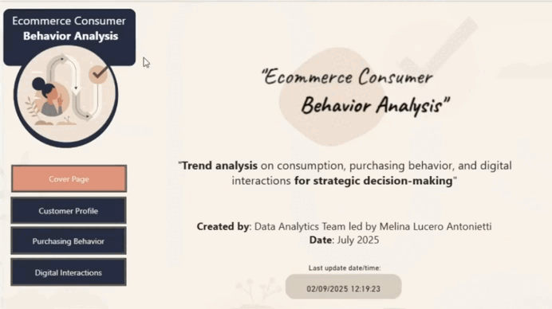
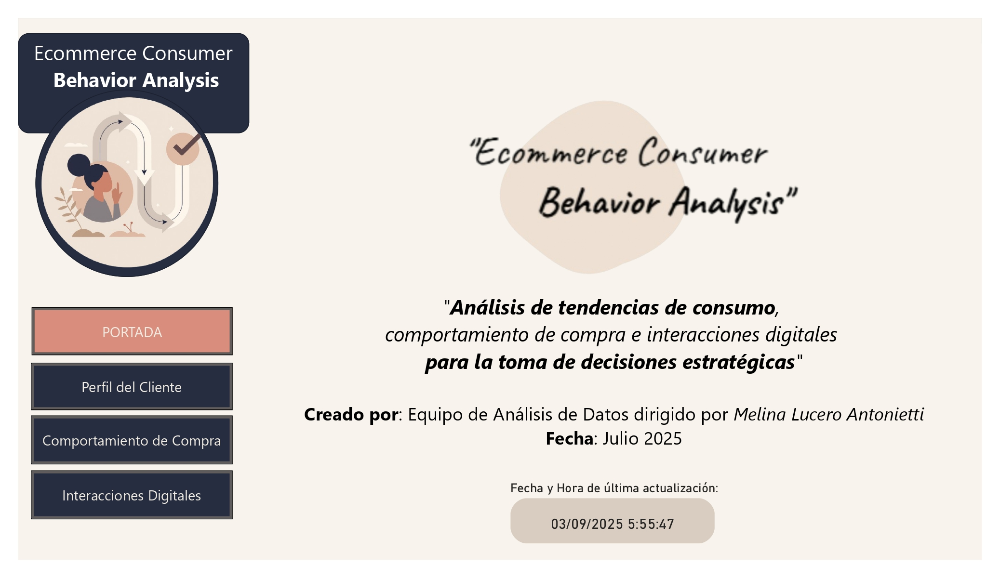
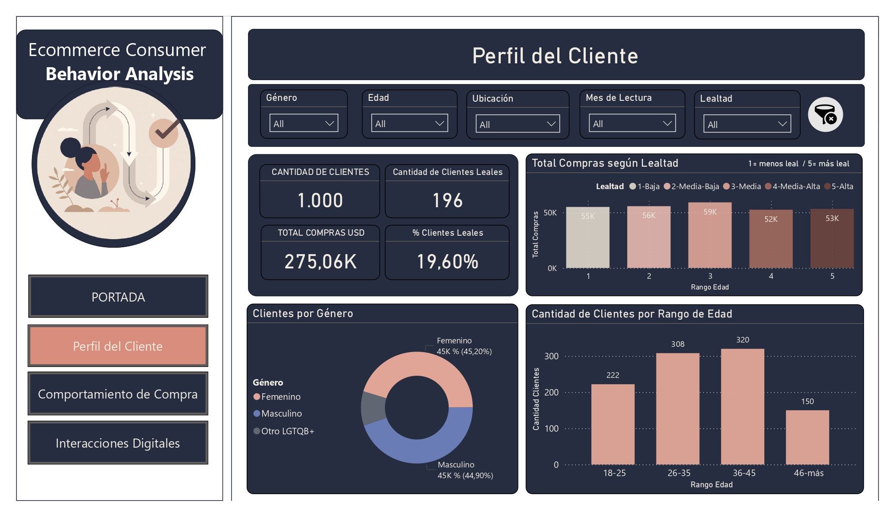
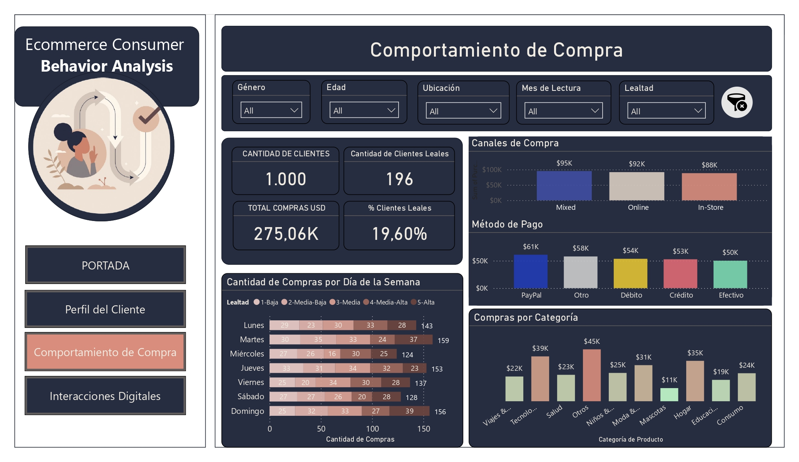
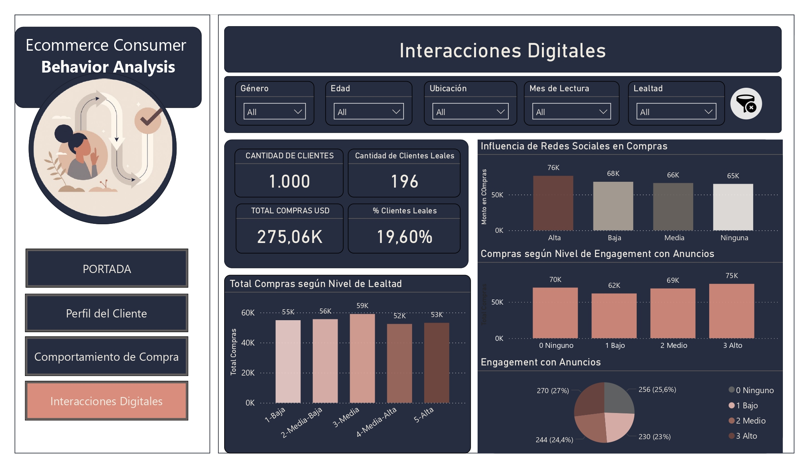

# 📦 Análisis del Comportamiento del Consumidor en E-commerce

Proyecto final para el curso de Data Analytics (CoderHouse), enfocado en analizar la lealtad del consumidor y la interacción digital en e-commerce utilizando Power BI.

---

## 📊 Resumen del Proyecto

Este proyecto explora:
- Segmentación demográfica de clientes  
- Patrones de comportamiento de compra según nivel de lealtad  
- Tendencias por día de la semana, canales y métodos de pago  
- Interacción digital: engagement con anuncios, influencia de redes sociales, tiempo de investigación  

Fue construido con un dataset completamente normalizado en Excel, KPIs personalizados con DAX y un dashboard estructurado para storytelling de negocio.

📄 **[Ver Documentación del Proyecto en PDF](https://drive.google.com/file/d/1sWJNvZfS4sjSl2tlqiglbzCxuXE6Q1DS/view?usp=drive_link)**  

---

## 🛠️ Herramientas Utilizadas

- **Power BI** (dashboard interactivo, medidas personalizadas en DAX, slicers, bookmarks)  
- **Excel** (dataset normalizado y relacional, modelo de hechos y dimensiones)  
- **SQL & DAX** (agregaciones, KPIs, time intelligence, lógica)  

---

## 📂 Archivos

| Nombre del Archivo | Descripción |
|-------------------|-------------|
| `Project DOC_Ecommerce Consumer Behavior Analysis.pdf` | Reporte completo y documentación del proyecto |
| `Dashboard Power BI_Ecommerce Consumer Behavior Analysis.pbix` | Dashboard interactivo en Power BI |
| `Dataset_Ecommerce Consumer Behavior Analysis.xlsx` | Dataset limpio y normalizado |
| `/assets/*.png` | Visuales de las páginas del dashboard |

---

### 🔧 Normalización de Datos

El dataset original contenía estructuras redundantes y desnormalizadas, lo cual podía afectar el rendimiento y la flexibilidad al construir un modelo de datos relacional. Por ello, se realizó un proceso de normalización completo, obteniendo un dataset más limpio y estructurado.

Principales pasos realizados:

* **División de tablas grandes**: El dataset original agrupaba atributos diversos en una sola tabla (ej: detalles del cliente, registros de compra, info de productos). Se dividió en entidades separadas:
  * `Clientes`: identificadores únicos y datos demográficos.  
  * `Compras`: cada transacción con detalles específicos.  
  * `Productos` / `Categorías de Compra`: categorías, subcategorías y precios.  
  * `Interacciones`: métricas de engagement (anuncios, satisfacción, tiempo de investigación).  
* **Eliminación de repeticiones**: Valores repetidos como género, nombres de categoría, métodos de pago y países fueron extraídos a tablas de dimensión.  
* **Creación de relaciones**: Se definieron claves primarias y foráneas (ej: Customer_ID, Product_ID) para garantizar la integridad referencial.  
* **Manejo de fechas**: Se creó una **tabla calendario** en Power Query para un manejo adecuado del análisis temporal (día, mes, trimestre, año, etc.), fundamental para KPIs dinámicos.  

Esta normalización mejora la integridad de los datos, el rendimiento en Power BI y permite una exploración visual más precisa mediante relaciones en el modelo de datos.

🧿 **[Ver Dataset normalizado](https://docs.google.com/spreadsheets/d/1vLMK2MhfSIqIO2TF7NGt0KCjpOP-koZQ/edit?usp=drive_link&ouid=118301805959079266186&rtpof=true&sd=true)**  

---

### 🧹 Preparación & Transformación de Datos

Se realizaron varias tareas de preprocesamiento y modelado para optimizar la visualización y análisis en Power BI. Algunas decisiones principales:

#### ✅ Filtros para lectura dinámica

* **Género**: El dataset original incluía 8 categorías. Se consolidaron en 3 grupos clave: *Femenino*, *Masculino* y *Otro/LGBTQ+*.  
* **Edad**: El valor original era un número entero. Se transformó en **rangos etarios** y se agregó un **tooltip** para mostrar la edad exacta al pasar el cursor.  
* **Ubicación**: A partir de ciudades, se derivó **país** y luego se agruparon en **continentes** para un análisis macro.  
* **Nivel de lealtad**: Se creó una segmentación del 1 al 5 con etiquetas descriptivas (*ej: 1 - Bajo, 5 - Alto*).  
* **Filtro de Mes & Botón Reset**: Se añadió un slicer mensual y un botón *"Limpiar Filtros"* para reiniciar la vista.  

---

#### 📦 Categorización de Productos

* La lista original era demasiado granular. Para simplificar:
  * Se creó una columna de **macro-categorías** (ej: “Hogar”, “Moda”, “Tecnología”).  
  * Se agregó un **tooltip** que muestra las micro-categorías al pasar el cursor, manteniendo detalle sin sobrecargar la visualización.  

---

#### 📊 Navegación & Layout

* Se diseñó un **menú de navegación** en la parte superior de cada página.  
* Se mantuvo consistencia visual en layouts y colores.  
* Cada página incluye KPIs claros y gráficos concisos, con **gradientes de color** (ej: rosa a verde en volumen de compras) y diferenciación por método de pago o tipo de engagement.  

---

#### 🧠 Implementación de Tooltips

* **Tooltip #1**: En el gráfico de Rango Etario, muestra edades individuales dentro de cada rango.  
* **Tooltip #2**: En el gráfico de Compras por Categoría, despliega micro-categorías.  

---

### 🖼️ Vista General del Dashboard

Aquí un resumen visual del dashboard.  
Para la versión completa:  

🧿 **[Ver Dashboard en PDF](https://drive.google.com/file/d/1XS3hGomkOAfIDBgiUbECpNmpuo5puQKS/view?usp=sharing)**  
🧿 **[Descargar Dashboard en PBIX](https://drive.google.com/file/d/1jIYLcaLyU8n0Zk_ORDWo9eNZWe1Ttg0T/view?usp=drive_link)**  

---

### 🎥 Vista en Acción

---

## 📸 Screenshots

### 🧭 Portada

### 👥 Perfil del Cliente

### 🛒 Comportamiento de Compra

### 📲 Interacciones Digitales

---

### 📊 Métricas Clave

- 🎯 Compras Totales  
- 🛒 Ticket Promedio  
- 📅 Día con Más Compras  
- 💳 Métodos de Pago Principales  
- 📈 Nivel de Engagement  
- 🎯 Distribución por Nivel de Lealtad  

---

## 📎 Link al Portafolio

🧿 **[Ver PDF, Dataset & Power BI en Google Drive](https://drive.google.com/file/d/1C_-P62q6jKNuokIZLGhFoteir2ee4XJS/view?usp=drive_link)**

---

## 📌 Insights Clave

- La mayoría de las compras provienen de clientes con lealtad media (nivel 3).  
- Los clientes más leales son más consistentes pero gastan ligeramente menos en total.  
- El engagement en redes sociales y anuncios influye fuertemente en clientes de lealtad media.  
- Los compradores más frecuentes tienen entre 36–45 años y una distribución de género equilibrada.  

> ⚠️ **Nota Importante:**  
> Los datos utilizados en este proyecto son **ficticios y simulados**, creados únicamente con fines de **práctica y demostración académica**.  
> Por este motivo, los resultados del análisis **pueden carecer de consistencia** y no deben interpretarse como representativos de un caso real de negocio.

---

## 🔮 Trabajo Futuro

- Modelo predictivo de segmentación de lealtad con machine learning.  
- Análisis detallado por subcategorías de producto.  
- Seguimiento del rendimiento de campañas y A/B testing.  
- Recomendaciones para mejorar retención y personalización.  

---

### ⚠️ Limitaciones

- El dataset contiene datos simulados/agrupados que pueden no reflejar fielmente el comportamiento real.  
- Las métricas de engagement son auto-reportadas, no conductuales.  
- Algunos campos tenían valores faltantes o ambiguos, lo que requirió generalización (ej: género o ubicación).  

---

⭐ *Gracias por visitar! Explora el dashboard y no dudes en compartir feedback o propuestas de colaboración.*  

---

## 📫 Contacto

Para consultas o colaboraciones:  
📧 [melinaluceroant@gmail.com]  
📎 [https://www.linkedin.com/in/melina-lucero/]  

---

### 📚 Referencias

- Dataset provisto por XYZ Ecommerce (o Kaggle, etc.)  
- Lógica de tabla calendario en Power BI de la documentación oficial de Microsoft.  
- Íconos de [Flaticon.com](https://www.flaticon.com)  

